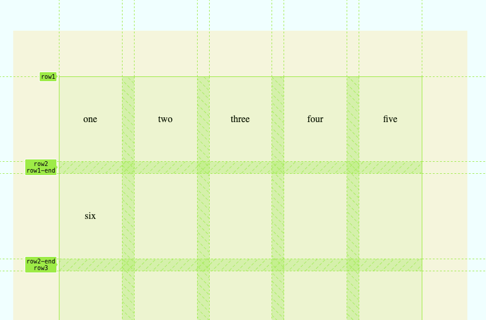
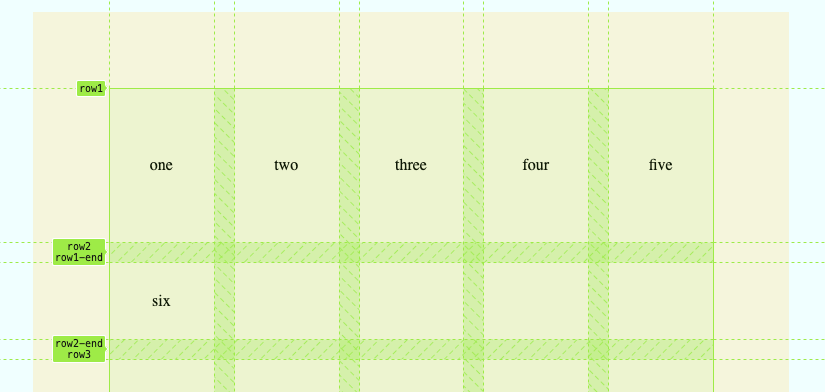

# Fake portfolio to practice css grid

## Progress so far

A grid system 6 x 5 where
each child of portfolio-wrapper
will occupy one square

Name in css and visualize Rows/Columns with names in Brave dev-tools.

Using height 100%
actually makes the grid wrapper
use all the available space from parent.

1 fr refers to fraction.
Which means that
the grid row/column should fill 1/1 Unit
of the available grid row/column space.

Using 0.5 fills 50% of the row as shown below in (2,1)

